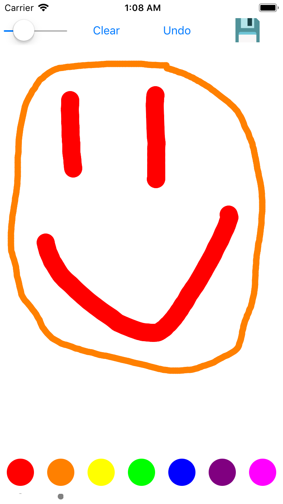

# Drawing App
Third lab for CSE 438: Mobile Application Development. Simple drawing app following the model, view, controller paradigm. 

## About

 This app allows the user to draw and doodle. The app was made to adjust to any screen size, and takes advantage of using auto layout with all the proper constraints. This app features the ability to adjust the line thickness, change the color of the line, and save the user's art work by saving a screen shot to the user's photo library. 

 

